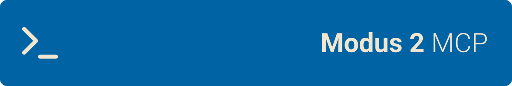

# MCP Modus

<div align="left">
  
</div>

<a href="https://glama.ai/mcp/servers/@julianoczkowski/mcp-modus">
  
</a>

[](https://www.npmjs.com/package/@julianoczkowski/mcp-modus)
[](https://opensource.org/licenses/MIT)

**AI assistant for Modus Web Components** - Get instant help with component documentation, design rules, and setup guides directly in your IDE.

## What This Does

This MCP server gives AI assistants (like Cursor, Claude, VS Code) access to complete Modus Web Components documentation. Ask questions like:

- _"How do I use a Modus button with primary color?"_
- _"What are the Modus color guidelines?"_
- _"Show me how to set up a React project with Modus components"_
- _"Which components have a disabled attribute?"_

## Setup

Choose one of the two options below:

### Option 1: NPX (Recommended - No Installation)

**For any IDE with MCP support:**

```json
{
  "mcpServers": {
    "modus-docs": {
      "command": "npx",
      "args": ["-y", "@julianoczkowski/mcp-modus"]
    }
  }
}
```

**Benefits:** No installation required, always uses latest version, no permission issues, secure pre-bundled documentation.

### Option 2: Global Install

1. **Install globally:**

   ```bash
   npm install -g @julianoczkowski/mcp-modus
   ```

   > **Note**: On some systems, you may need `sudo npm install -g @julianoczkowski/mcp-modus`

2. **Use this config:**
   ```json
   {
     "mcpServers": {
       "modus-docs": {
         "command": "mcp-modus"
       }
     }
   }
   ```

**Benefits:** Faster startup, works offline after installation, secure pre-bundled documentation.

## IDE-Specific Instructions

### For Cursor IDE

1. Go to `Settings → Features → MCP`
2. Click "Add New MCP Server"
3. Use one of the JSON configs above

### For VS Code (with Continue)

Add to `~/.continue/config.json` using one of the JSON configs above.

### For Claude Desktop

Add to your config file using one of the JSON configs above:

- **macOS**: `~/Library/Application Support/Claude/claude_desktop_config.json`
- **Windows**: `%APPDATA%/Claude/claude_desktop_config.json`

## What You Get

### 📚 **Component Documentation** (43+ components)

- Complete API documentation for all Modus Web Components
- Usage examples and best practices
- Attribute and event references

### 🎨 **Design System Guidelines**

- Color palettes and usage rules
- Icon guidelines and available icons
- Spacing, typography, and layout systems
- Border radius and stroke guidelines

### ⚙️ **Project Setup Guides**

- HTML project setup instructions
- React project integration guide
- Theme implementation and customization
- Testing guidelines and best practices

## Example Usage

Once configured, ask your AI assistant:

```
"Create a Modus button with warning color and medium size"
"What spacing values should I use in my Modus design?"
"How do I set up a new React project with Modus Web Components?"
"Show me all Modus form components"
"What are the available Modus color tokens?"
```

The AI will use the MCP server to fetch the latest documentation and provide accurate, up-to-date answers.

## Security & Reliability

- **🔒 Pre-bundled Documentation**: All documentation is included with the package - no runtime downloads
- **🛡️ No External Dependencies**: Runs completely offline after installation
- **✅ Verified Content**: Documentation is verified during our CI/CD process
- **🚀 Fast & Secure**: No network requests during operation

## Troubleshooting

### Server Not Connecting

- Ensure Node.js 18+ is installed: `node --version`
- For global install: verify with `mcp-modus --help`
- Check IDE logs for error messages

### Documentation Updates

**Documentation is pre-bundled** with each release for security and reliability. No downloads occur during installation or runtime.

### Uninstalling

If you used the **NPX option** (Option 1), no permanent installation exists. NPX downloads are temporary.

If you used the **Global Install option** (Option 2), uninstall with:

```bash
npm uninstall -g @julianoczkowski/mcp-modus
```

### Need Help?

- [GitHub Issues](https://github.com/julianoczkowski/mcp-modus/issues)
- [Modus Web Components Docs](https://modus.trimble.com/)

---

**Built for developers using Modus Web Components** | **MIT License** | **Made by Julian Oczkowski**